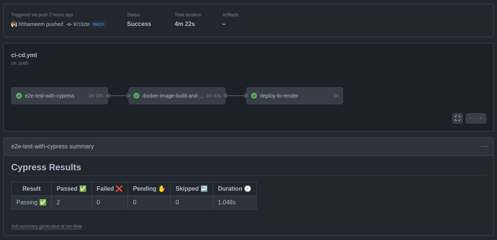
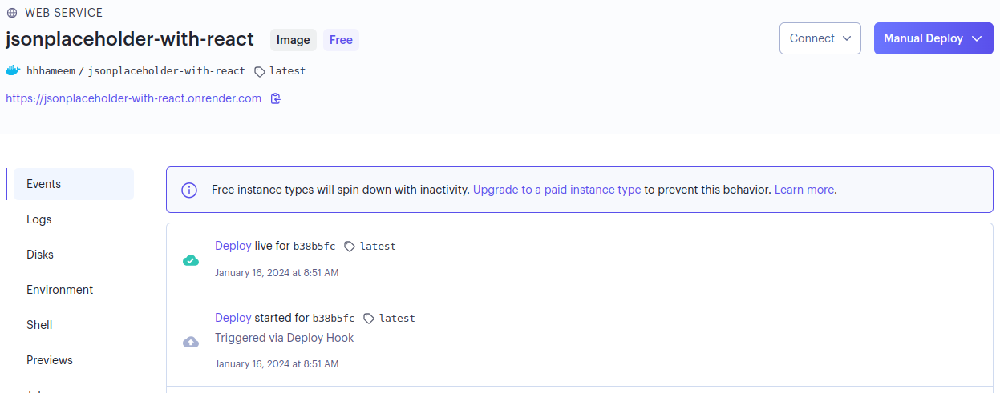

# {JSON} Placeholder With React

[](https://github.com/hhhameem/jsonplaceholder-with-react/actions/workflows/ci-cd.yml) [](https://dashboard.render.com/web/srv-cmho51fqd2ns73ftn6og)

Simple React.js app made in my early learning-react-days. Recently brushed up to practice CI-CD. Using Cypress to test, Github actions for automation, Docker Hub to host the docker image of this service, Render to deploy the service as a docker container, and NGINX as an HTTP web server. Also, introduced Docker Compose to support ease of development and hot-reloading.

Live: [https://jsonplaceholder-with-react.onrender.com/](https://jsonplaceholder-with-react.onrender.com/)

#### N.B:

- Added only two basic test as this is a practice project.
- Hosted the image repository as public to be visible to everyone
- I did not follow best-practice in some steps intentionally.
- There are always scope for improvement.

## Technologies used for CI-CD

- Docker (To containerize application)
- Docker compose (For learning. Not part of ci-cd)
- Docker Hub (As container image repository)
- Cypress (For e2e test)
- Render (To deploy the service as docker image)
- Github Actions (To automate the Test-Build-Deploy process)

## Prerequisites

- Docker or Node installed

  N.B: node v18.19.0 is required to pass the workflow.

## Use Docker to deploy locally

- Clone the repository

```bash
git clone https://github.com/hhhameem/jsonplaceholder-with-react.git
```

- Go inside the repository and run the command

```bash
docker build -t ${name}:${tag} .
```

N.B: DO NOT MISS THE TRAILING PERIOD(.)

- Now, as the docker image creation is complete we need to run the image as a container. Run the command below to achieve that

```bash
docker run ${name}:${tag}
```

The service should be now up and running.

## Use traditional way to deploy locally

- Clone the repository

```bash
git clone https://github.com/hhhameem/jsonplaceholder-with-react.git
```

- Go inside the repository and run the command

```bash
npm install
```

- Now, as all the packages are downloaded we need to start the development server. Run the command below to achieve that

```bash
npm start
```

The service should be now up and running.

## Run Cypress to test

You need to run the below command inside the project root folder to install the cypress to use it.

```bash
npm install
```

Now as Cypress is installed you can run the below command to run the tests. Before running the command, make sure the service is up and running

```bash
npx cypress run
```

## Images

Github Workflow :



Render Deployment :



## Thanks goes to

- [render-deploy-status](https://github.com/Cutaiar/render-deploy-status) for deployment status badge
